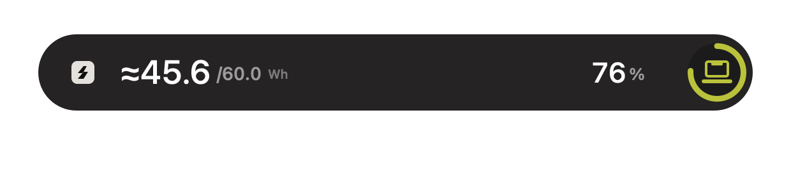
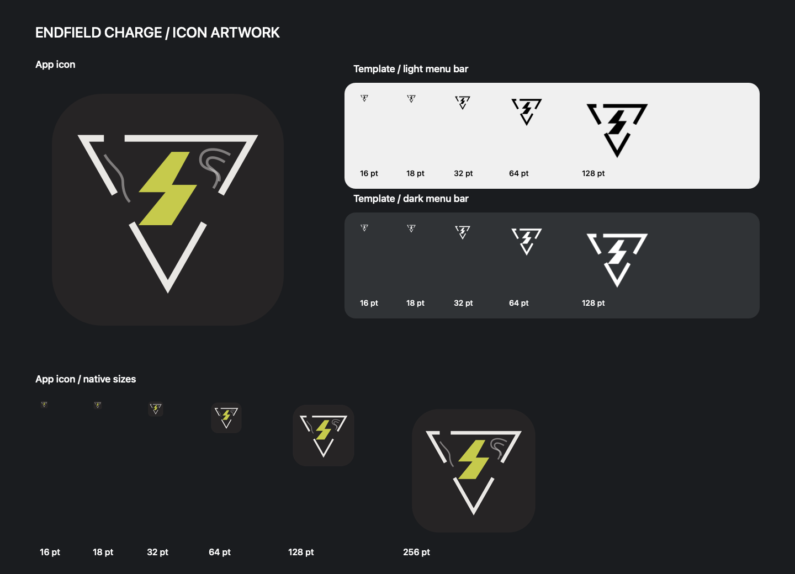
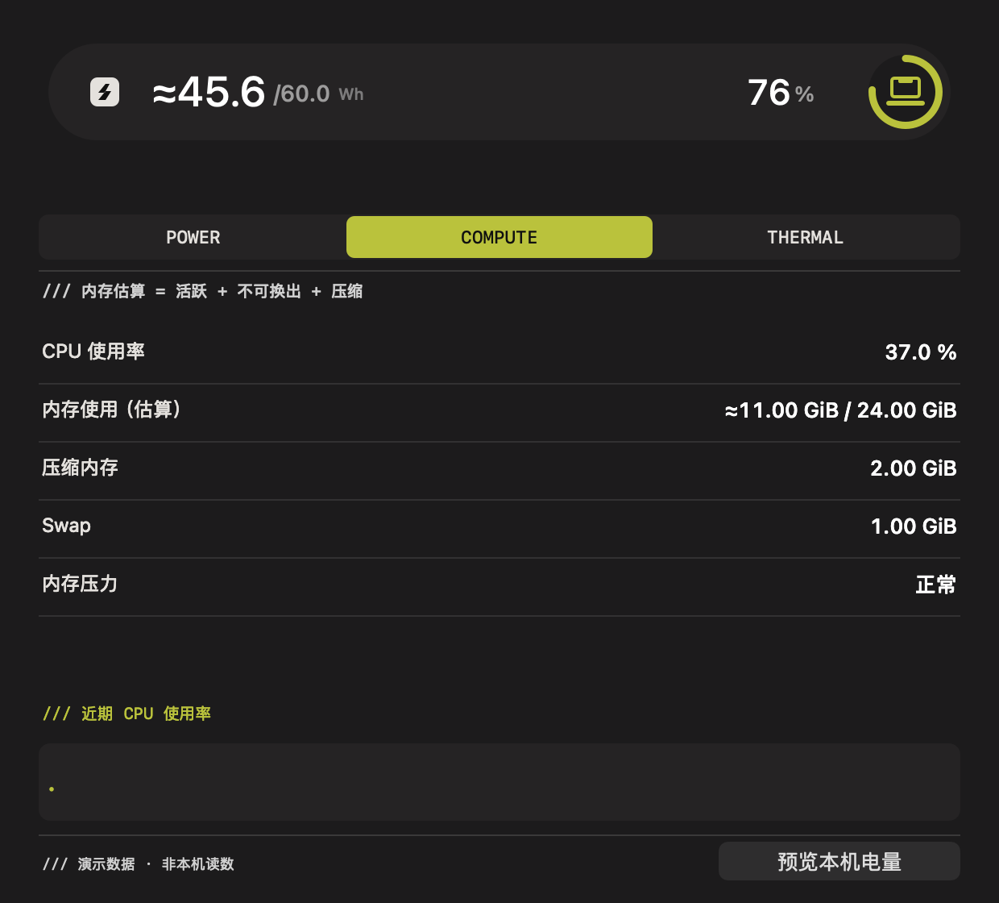

# Endfield Charge · macOS 终末地风格电量 HUD

一个原生 Swift 菜单栏工具。插拔充电器时，从屏幕顶部弹出「电标 → 模式标题 → 电量胶囊」三段动画，视觉、图案、配色及节奏参考 [QinAnze/zmd-charge](https://github.com/QinAnze/zmd-charge)。菜单栏中的「遥测终端」提供电源、CPU/内存与系统散热状态；数据只在本机采集和展示。






## 使用

需要 macOS 13 或更新版本。应用支持 Apple Silicon 与 Intel；本地通过 `--universal` 打包可得到双架构版本。

下载 [最新正式版安装包](https://github.com/MarkYang44/Endfield-Charge/releases/latest/download/Endfield-Charge-macOS.zip)（[发行说明](https://github.com/MarkYang44/Endfield-Charge/releases/latest)）或 [GitHub Actions 构建产物](https://github.com/MarkYang44/Endfield-Charge/actions)，解压后把 **Endfield Charge.app** 放入 Applications，双击启动。菜单栏会出现电标和电量。点击图标可预览、模拟插拔电源、打开遥测终端、设置或退出。

默认全局快捷键 **Control + Option + H**。在「设置 → 通用」中可组合选择 ⌘ Command、⌃ Control、⌥ Option、⇧ Shift 和 A–Z 字母，例如 **Command + Shift + E**；至少选择 Command、Control 或 Option 中的一个。快捷键不可用时会在设置中提示，可随时关闭。升级会保留原有设置。应用不需要辅助功能或录屏权限。默认关闭登录启动，移入 Applications 后可在设置中主动开启。

本地构建使用 ad-hoc 签名，尚未经过 Apple 公证。网络下载的副本可能需要通过 macOS 的“打开”或“隐私与安全性”流程确认。不要关闭 Gatekeeper。

## 功能

- 忠实保留 560×60 → 560×90 → 560×60 胶囊、双平行四边形电标、白色标题、黄绿色笔记本电量环；低于 20% 时电量环变红。
- 插电波纹向外扩散，拔电波纹向内收拢；HUD 不抢焦点、不挡鼠标，可见胶囊紧贴菜单栏和刘海下方（间距约 2 pt），展开时向下伸展。
- IOKit 电源事件监听、400ms 去抖、30 秒刷新兜底和唤醒后刷新。动态阶段保持 60 Hz，静止显示阶段只等待关闭时刻；结束后释放 HUD 窗口与绘图视图。
- 真实百分比、剩余时间和近似 Wh（一位小数）；正确区分接电未充电、正在充电、已充满及电池供电。
- App 图标采用炭黑底、断开倒三角、密集等高线与黄绿色几何闪电，倒三角下方复用原标识的 ENDFIELD 矢量字标；菜单栏保持原有单色简化版，跟随 macOS 明暗主题。原始 SVG 与新矢量源均保留。
- 多显示器选择、顶部左/中/右、40–120% 缩放、3–10 秒时长、波纹开关、中文/英文/跟随系统、菜单栏百分比。
- 低电量、充满和系统低电量模式切换提醒，阈值可调；首次启动不会补发历史提醒。
- 跟随系统“减少动态效果”，使用简化淡入淡出。设置自动保存到应用的 UserDefaults 域。
- 遥测终端直接复用原 HUD 的几何与三段开场，2.52 秒后停止动画计时器；页面采用炭黑、灰白和黄绿色。POWER 显示电池侧估算功率、适配器报告功率、循环次数和近期放电均值；COMPUTE 显示 CPU、估算内存、压缩内存、Swap 与系统内存压力；THERMAL 显示系统热状态。
- 单枚遥测定时器：窗口可见时每 2 秒、关闭/最小化/隐藏时每 30 秒采样。三模块可在「设置 → 遥测」分别关闭，全部关闭后停止额外定时器；散热压力提醒可独立关闭。严重/临界状态使用原风格 HUD，启动时不补发，重复与降级不会刷屏。



CPU 使用率由两次 Mach tick 计数差计算；第一条读数或计数重置后显示 `—`。内存估算为 `(active_count + wire_count + compressor_page_count) × 系统页大小`，压缩内存采用压缩器实际占用；这与“活动监视器”的“已用内存”口径不同。电池侧 W 为电压×有符号电流，`+` 表示充电、`−` 表示放电；适配器 W 是报告的额定值，不能当作实际整机或充电功率。放电均值按已观察间隔加权，最多覆盖最近 5 分钟，充电、缺失读数或超过 60 秒的间断会清空。

热状态采用系统公开的 nominal/fair/serious/critical 等级，**不代表 CPU 实测温度**。内存压力和电池 registry 属性可能不可用，此时显示 `—`。曲线按实际采样时间绘制、长间断不连线，只保留窗口当前会话最多 300 个点；关闭窗口后整个界面进程退出，没有长期记录、后台上传或外部运行时。

“超充模式”沿用主题文案，**不代表实际检测到快充协议**。macOS IOPS 的容量通常是百分比，本项目不会把 100% 假装成 100mAh。Wh 只在系统另有原始物理容量和电压时推算，并以 **≈** 标注；这些 registry 字段并非稳定的公开接口，读不到时显示 `—`。根据当前电压估算的能量不能当作精确测量。充满提醒以系统已充满，或停止充电且 ≥99% 为准，并在重新消耗至 ≤95% 或拔电后重新允许提醒。

## 从源码构建

需要 Swift 6 工具链，安装 Xcode 或 Apple Command Line Tools 即可；无第三方包依赖。应用部署目标是 macOS 13；测试使用 Swift Testing，建议在 macOS 14+ 运行。

```bash
git clone https://github.com/MarkYang44/Endfield-Charge.git
cd Endfield-Charge
bash scripts/test.sh
bash scripts/build-app.sh --universal
open "dist/Endfield Charge.app"
```

只编译本机架构可以省略 `--universal`。产物：`dist/Endfield Charge.app` 和 `dist/Endfield-Charge-macOS.zip`。`scripts/test.sh` 包含 Command Line Tools 环境下 Swift Testing 的 framework 路径适配。

在有图形桌面的本机可额外运行 `bash scripts/check-runtime.sh`，检查原生窗口释放、消息传输、快速重开和提醒排队。它使用独立测试偏好域，不修改已安装应用的设置；CI 只运行不依赖桌面的核心测试。

```bash
"dist/Endfield Charge.app/Contents/MacOS/EndfieldCharge" --snapshot
open "dist/Endfield Charge.app" --args --preview
open "dist/Endfield Charge.app" --args --demo
open "dist/Endfield Charge.app" --args --preview-unplug
open "dist/Endfield Charge.app" --args --settings
"dist/Endfield Charge.app/Contents/MacOS/EndfieldCharge" --telemetry
"dist/Endfield Charge.app/Contents/MacOS/EndfieldCharge" --telemetry-snapshot
"dist/Endfield Charge.app/Contents/MacOS/EndfieldCharge" --render-telemetry /tmp/terminal.png --tab compute --demo
"dist/Endfield Charge.app/Contents/MacOS/EndfieldCharge" --render /tmp/hud.png --demo --stage 1.55
```

`--snapshot` 输出实际电池 JSON；`--telemetry-snapshot` 在间隔 1 秒的两次采集后输出实际遥测 JSON。`--render-telemetry` 支持 `--tab power|compute|thermal`、`--stage seconds` 和 `--reduce-motion`；`--demo` 会在图中明确标注演示数据。导出 PNG 和读取 JSON 不启动常驻进程。

直接调用可执行文件时，`--telemetry`、`--settings`、`--preview`、`--demo`、`--preview-unplug` 会将固定动作转发给已有常驻实例。macOS `open … --args` 在应用已经运行时不能可靠传递参数，此时用菜单栏或直接调用可执行文件；普通双击重开依然预览实际电量。

## 项目结构

```text
Sources/ChargeCore/          电池/遥测模型、差分与均值、事件、动画时间线、偏好与通信
Sources/EndfieldCharge/      原生采集/监听、AppKit HUD与遥测、菜单栏、快捷键、界面进程生命周期
Tests/ChargeCoreTests/       电量、事件和动画测试
Tests/RuntimeChecks/         需要图形桌面的原生生命周期与通信检查
Resources/                  新图标 PNG / SVG 与用户提供的原始标识
scripts/                    图标矢量导出、测试与 .app / zip 打包
.github/workflows/          通用架构 CI、标签 Release
docs/                       设计、执行计划、验证记录与预览图
```

图标的原生矢量源可重复导出：

```bash
swift scripts/render-icons.swift
```

推送 main 会测试并打包 universal zip；推送 `v*` 标签会创建 Release。尚未签发 Developer ID 或公证，CI 使用 ad-hoc 签名。

## 内存与体积

设置和遥测界面使用原生 AppKit，并按需以同一可执行文件的独立进程打开；关闭窗口后进程退出，释放系统控件、字体和曲线缓存。常驻部分只有原电池监听/菜单栏/快捷键与低频遥测采集，无第三方运行时。私有管道只传单次采样和偏好，正常关闭在最终状态确认后退出，保留当前会话的页签和窗口位置；主进程无响应时另有 2 秒退出兜底。

遥测版本 `b1e77d1`（图标更新前）的同机三轮冷启动测量如下，采用整个应用进程组的 physical footprint、采样末值中位数：

| 场景 | 遥测加入前 | 遥测版实测 |
| --- | ---: | ---: |
| 空闲常驻 | 11.20 MiB | 11.36 MiB |
| 设置打开 | 42.55 MiB | 41.97 MiB |
| 原电量动画结束后 | 14.33 MiB | 14.44 MiB |
| 遥测终端打开 | — | 55.63 MiB |
| 遥测界面进程退出后 | — | 11.30 MiB |

遥测窗口开场动画有短暂绘图缓存开销，三轮 200 ms 采样的最高观测值为 98.05 MiB。常驻增量约 0.16 MiB；关闭后界面进程退出。详细验证、测量口径和边界见 [遥测验证](docs/telemetry-validation.md)，汇总与完整压缩采样见 [测量数据](docs/telemetry-measurements.json)。该次测量未加入额外包或运行时；当时的双架构可执行文件 980,288 B，ZIP 490,449 B。

此前原生界面释放优化的三轮冷启动测量如下（源码 `599642c`，尚未加入遥测）。采用进程 physical footprint，设置打开时合计主进程与设置进程；每项取采样末值的中位数。

| 场景 | 优化前 | 优化后 |
| --- | ---: | ---: |
| 冷启动空闲 | 11.69 MiB | 11.38 MiB |
| 设置打开 | 34.88 MiB | 42.42 MiB |
| 演示动画结束后 | 14.49 MiB | 14.36 MiB |
| 双架构可执行文件 | 1,359,024 B | 726,576 B |
| 应用磁盘占用（du） | 1,504 KiB | 888 KiB |

设置打开时总占用有所增加，换来关闭后界面缓存能够完整退出；冷启动和动画场景的内存变化较小。完整审查、关闭后实测及测量限制见 [内存审查](docs/memory-audit.md)，三轮记录见 [测量数据](docs/memory-measurements.json)。这不代表所有系统版本都会得到相同数值。

退出正在运行的应用后，可复测整个进程组：

```bash
python3 scripts/profile-memory.py "dist/Endfield Charge.app/Contents/MacOS/EndfieldCharge" /tmp/endfield-memory.json
python3 scripts/profile-memory.py "dist/Endfield Charge.app/Contents/MacOS/EndfieldCharge" /tmp/endfield-telemetry-memory.json --telemetry
```

需要 Python 3 和 Command Line Tools；脚本只用于开发测量，不随应用启动。物理占用、RSS、虚拟地址空间和 `.build` 编译缓存采用不同口径，不能混作软件运行内存。

MIT。参考设计、图标与几何来源见 [THIRD_PARTY_NOTICES.md](THIRD_PARTY_NOTICES.md)。这是非官方工具。
